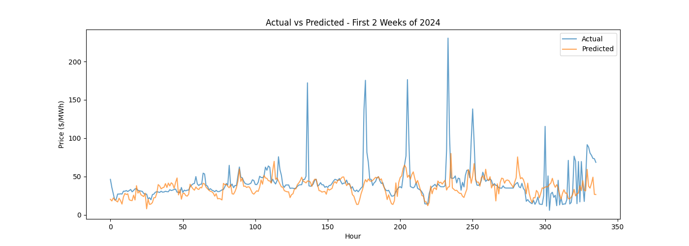

# Ontario Electricity Price Forecast

A machine learning project to forecast Ontario hourly electricity spot prices 24 hours ahead using historical IESO market data.

## Problem

Electricity prices in Ontario are volatile and hard to predict. They swing from near zero to over $1,000/MWh in the same day. Industrial consumers, energy traders, and grid operators need accurate price forecasts to make better decisions about when to buy, sell, or shift energy use.

This project builds a machine learning model trained on 5 years of historical IESO data to predict hourly Ontario electricity prices.

## Data Sources

All data is publicly available from the [IESO Data Directory](https://www.ieso.ca/Power-Data/Data-Directory):

- **Hourly Ontario Energy Price (HOEP)** — hourly electricity prices in $/MWh (2020–2025)
- **Ontario Demand Reports** — hourly electricity demand in MW (2020–2025)

## Methodology

**Data pipeline:** 12 raw CSV files loaded, merged by date and hour into a single dataset of 46,728 hourly observations.

**Feature engineering:** Extracted time-based features (hour, day of week, month, is weekend) and lag features (price and demand from 24 and 48 hours prior) to capture daily and weekly cyclicality.

**Model:** Random Forest Regressor trained on 2020–2023 data (35,016 hours), evaluated on 2024–2025 data (11,664 hours) the model never saw during training.

## Results

| Metric | Value |
|--------|-------|
| MAE | $13.38 /MWh |
| RMSE | $36.50 /MWh |

The model captures typical daily and weekly price patterns well. The gap between MAE and RMSE indicates the model underestimates rare price spikes — a known challenge in electricity price forecasting.

## Project Structure
├── load_data.py        # Loads and merges raw IESO CSV files
├── features.py         # Feature engineering pipeline
├── model.py            # Model training, evaluation, and visualization
├── ieso_data/          # Raw data (not tracked in git)

## Tech Stack

Python, pandas, matplotlib, scikit-learn

## Status

- [x] Data acquisition and exploration
- [x] Data loading and merging pipeline
- [x] Feature engineering
- [x] Baseline Random Forest model
- [ ] Improved model (XGBoost, additional features)
- [ ] Walk-forward validation